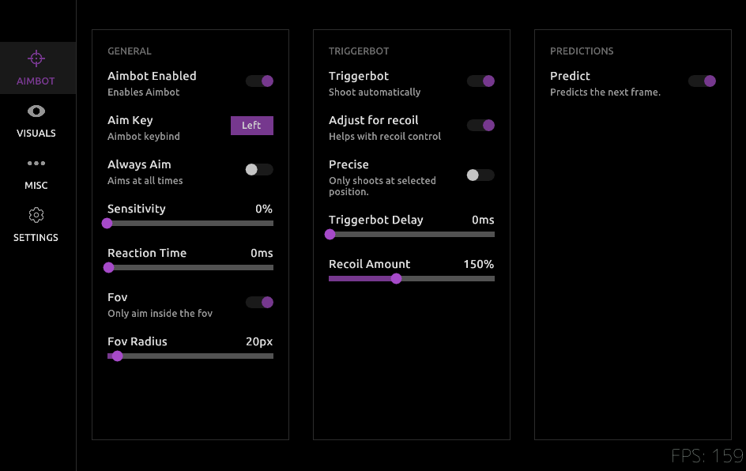

Computer vision is everywhere, but most of it is slow. A Python script running YOLO on a video feed might hit 30, maybe 60 FPS if you're lucky. That's fine for watching security cameras, but it's completely useless when the game you're playing is running at 200 FPS. Your AI is seeing frames that are ancient history. The target isn't there anymore.

This was the problem I wanted to solve with `AimAhead`. The goal wasn't to make an aimbot; the goal was to build a computer vision pipeline so fast and efficient that it could run ahead of the game loop. This meant throwing out the standard Python playbook and getting as close to the hardware as possible.

### Paying Your Dues with Data

Before you can write a single line of C++, you have to build the brain. And an AI model is just a dumb rock without a mountain of good data. This was the least glamorous part of the project, and it took weeks.

First, I just played the game and captured thousands upon thousands of screenshots. Every possible lighting condition, every map, every character model. You need variety, or your model will overfit on one scenario and be useless in another.

Then came the mind-numbing part. I uploaded all this data to an online labeling tool and spent days manually drawing bounding boxes around targets. Every. Single. One. You have to be precise. A sloppy box teaches the model sloppy habits. This is the foundation of the whole project, and if you screw it up, everything that comes after is worthless.

With a solid dataset labeled, I trained the smallest, fastest version of YOLOv8—the "n" model. I didn't need a massive model that could identify a thousand different objects. I needed a model that could do one thing—find a specific shape—and do it ridiculously fast. YOLOv8n was the perfect trade-off between accuracy and inference speed.

### A Zero-Copy GPU Pipeline

The number one rule of performance is to avoid moving data. The moment you copy a texture from your GPU's VRAM to your system's RAM, you've lost. That CPU-GPU bus is a massive bottleneck. The entire design of AimAhead is built around a "zero-copy" principle.

Most screen capture tools work by copying a frame from the GPU to the CPU, then you process it, and maybe send some data back. It's slow. I used the Desktop Duplication API, a part of DirectX. Its killer feature is that it gives you direct access to the back buffer as a DirectX texture, right on the GPU.

It never touches system RAM.

```cpp
// This is a simplified concept, not production code.
// Get the frame from the Desktop Duplication API
ID3D11Texture2D* pGpuFrame = nullptr;
hr = m_pDuplication->AcquireNextFrame(..., &pGpuFrame);

if (SUCCEEDED(hr)) {
    // We have the frame as a texture on the GPU.
    // DO NOT map it to the CPU.
    // Instead, pass this texture resource directly to our inference engine.
    
    RunInferenceOnGpuTexture(pGpuFrame);

    m_pDuplication->ReleaseFrame();
}
```

By keeping the data on the VRAM, we've eliminated the biggest performance killer. The raw pixels go straight from the game's render output into the AI's input, without ever taking a detour through the slow lane of system memory.

### Compiling the AI with TensorRT

So we have the frame on the GPU, but how do we run the YOLO model on it? The standard way is to use something like an ONNX runtime. It's fine, but it's built for compatibility, not speed.

This is where NVIDIA's TensorRT comes in. Think of it like a hyper-aggressive compiler for your AI model. You feed it the generic ONNX file, and it rebuilds it from the ground up specifically for your GPU. It does some incredible stuff.

*   It performs **Layer Fusion**, taking multiple layers of the neural network (like a convolution, a bias, and an activation) and merging them into a single, custom-built kernel. Fewer layers mean fewer read/write operations on VRAM.
*   It uses **Precision Calibration** to analyze the model and figure out where it can get away with using lower-precision math (like FP16 or even INT8) instead of the standard FP32, without losing much accuracy. Lower precision means faster calculations and less memory usage.

The result is a `.engine` file that is purpose-built for your exact GPU. It's not portable, but it is brutally fast. This is what takes the YOLOv8n model from "fast for AI" to "fast, period."

### Predicting Target Movement

Detecting an object is one thing. Hitting a moving one is another. By the time you've processed the frame and found the target, they've already moved. You can't just aim where they *are*; you have to aim where they're *going to be*.

I implemented a simple but very effective tracking and prediction layer. It's not fancy Kalman filters, just basic physics.

1.  When a target is detected, I store its bounding box.
2.  On the next frame, I detect it again.
3.  Now I have two positions and the time between frames. I can calculate a velocity vector.
4.  For the next prediction, I just take the target's last known position and add the velocity vector.

```cpp
// Logic for a single target tracker
FVector2D last_position = tracker.GetLastPosition();
FVector2D current_position = FindTargetInNewFrame();

if (IsFound(current_position)) {
    tracker.UpdatePosition(current_position);
    FVector2D velocity = (current_position - last_position) / delta_time;
    tracker.UpdateVelocity(velocity);
}

FVector2D predicted_position = tracker.GetLastPosition() + (tracker.GetVelocity() * prediction_time_ms);
```

This smooths out tiny jitters in the detection and allows the system to compensate for both the target's movement and the tiny amount of latency in the pipeline itself.

### Customizing ImGui Down to the Source

Finally, I needed a UI. I used ImGui because it's lightweight and easy to integrate. But I hate the default look. I wanted something clean and custom. I spent a lot of time creating a custom theme, but I quickly hit the limits of the standard style editor.

To get the look I really wanted, with unique outlines and window shapes, I had to go into the ImGui source code itself. I made modifications to the internal `Begin()` and `End()` window functions to change how the borders and backgrounds were rendered, giving me full control over the final look. It's overkill for most projects, but it was a fun exercise in understanding how a library you use every day actually works under the hood.


In the end, `AimAhead` became a case study in optimization. It's a demonstration that with the right approach—from the tedious work of data collection to low-level GPU memory management—you can build systems that operate at speeds the standard tools can't even touch.

You can check out the source code for the project on [my GitHub](https://github.com/ShufflePerson/AimAhead).