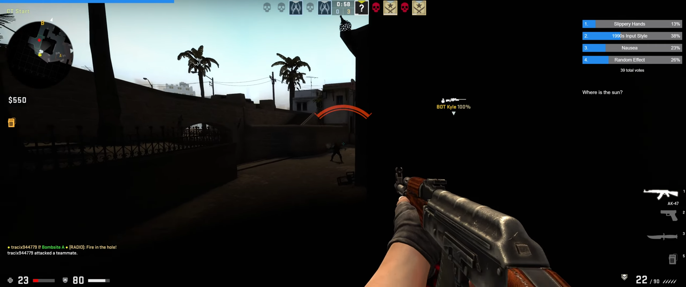

### Using game hacking as a disadvantage 

Counter-Strike: Global Offensive was a game of absolutes. It was about pixel-perfect precision, holding impossibly tight angles, and muscle memory drilled into your wrist over thousands of hours. It was a game about *control*.

So, naturally, I wanted to see what would happen if I threw all of that out the window.

What if, for 30 seconds, your aim shook like you’d had ten cups of coffee? What if the world turned into a psychedelic disco? What if, the moment you saw an enemy, your operator would just... drop their gun?

This was the idea behind CSGO Chaos, a project I built a few years back, inspired by the legendary GTA V Chaos Mod. The goal was to let a Twitch chat dictate the fate of my game, in real-time. And let me be crystal clear: **this was a passion project for learning and entertainment, used exclusively in private lobbies with friends.** This was never a cheat. It was an interactive toy designed to deconstruct a game I loved.

Now that CS:GO is gone, the project is a time capsule. I wanted to do a proper technical deep-dive on how it all worked—from the WinAPI calls that got me in, to the VTable hooks that gave me control.

### Breaching the Walls with `CreateRemoteThread`

You can’t just ask a game to run your code. You have to force your way in. The classic method is DLL injection, and the workhorse is the `CreateRemoteThread` technique. It's a surgical strike using a handful of Windows API calls to trick a target process into loading your DLL.

The logic is a simple, four-step hijack. First, you get the keys to the kingdom with `OpenProcess`. Then you allocate some memory inside the target, write your DLL's path into it, and finally, you create a new thread in the game that does nothing but call `LoadLibraryA` on that path.

It looks like this in practice:

```cpp
#include <windows.h>
#include <string>

void inject(DWORD processId, const std::string& dllPath) {
    // 1. Get a handle to the CS:GO process with all access rights.
    HANDLE hProcess = OpenProcess(PROCESS_ALL_ACCESS, FALSE, processId);
    if (!hProcess) {
        // Handle error...
        return;
    }

    // 2. Allocate memory inside CS:GO for our DLL path string.
    void* pDllPathAddress = VirtualAllocEx(hProcess, NULL, dllPath.length() + 1,
        MEM_COMMIT | MEM_RESERVE, PAGE_READWRITE);
    if (!pDllPathAddress) {
        // Handle error...
        CloseHandle(hProcess);
        return;
    }

    // 3. Write our DLL path into the memory we just allocated.
    WriteProcessMemory(hProcess, pDllPathAddress, dllPath.c_str(),
        dllPath.length() + 1, NULL);

    // 4. Create a new thread inside CS:GO. This thread's only job is
    // to call LoadLibraryA with our DLL path as the argument.
    // The address of LoadLibraryA is the same in our process as it is in csgo.exe.
    HANDLE hRemoteThread = CreateRemoteThread(hProcess, NULL, 0,
        (LPTHREAD_START_ROUTINE)GetProcAddress(GetModuleHandleA("kernel32.dll"), "LoadLibraryA"),
        pDllPathAddress, 0, NULL);
    
    if (hRemoteThread) {
        WaitForSingleObject(hRemoteThread, INFINITE); // Wait for the thread to finish.
        CloseHandle(hRemoteThread);
    }
    
    // Clean up the allocated memory.
    VirtualFreeEx(hProcess, pDllPathAddress, 0, MEM_RELEASE);
    CloseHandle(hProcess);
}
```
When that remote thread executes, the Windows loader maps `chaos.dll` into the game's address space, and my `DllMain` function gets called. I'm in.

### Mapping the Territory with Signature Scanning

Once inside, the game's memory is a black box. Hardcoding memory addresses is useless because they change with every game update. The solution is to hunt for them at runtime using Signature Scanning. A "sig" is a unique pattern of bytes that identifies a function or piece of data.

I wrote a simple scanner that takes a byte pattern and a "mask" string. The mask tells the scanner which bytes in the pattern must match exactly (`x`) and which can be ignored (`?`). This is crucial because some bytes in a signature might be part of a relative address that changes.

```cpp
#include <vector>

// Compares memory at a given location with a pattern and mask.
bool CompareBytes(const unsigned char* pData, const unsigned char* pPattern, const char* pszMask) {
    for (; *pszMask; ++pszMask, ++pData, ++pPattern) {
        if (*pszMask == 'x' && *pData != *pPattern) {
            return false;
        }
    }
    return (*pszMask) == NULL;
}

// Scans a memory region for a signature.
void* FindSignature(void* pBaseAddress, size_t moduleSize, const char* pszPattern, const char* pszMask) {
    unsigned char* pPatternBytes = (unsigned char*)pszPattern;
    
    for (size_t i = 0; i < moduleSize; ++i) {
        if (CompareBytes((unsigned char*)pBaseAddress + i, pPatternBytes, pszMask)) {
            return (void*)((unsigned char*)pBaseAddress + i);
        }
    }
    return nullptr;
}

// Example Usage: Find the IBaseClientDLL interface.
// This signature is just an example.
char* clientPattern = "\x8B\x0D\x00\x00\x00\x00\x8B\x01\xFF\x90";
char* clientMask = "xx????xxxx";
// g_pClient = FindSignature(...);
```
With this, I could reliably find the core Source Engine interfaces (`IBaseClientDLL`, `IVEngineClient`, etc.) every time the mod loaded, making it resilient to game updates.

### Seizing Control via VMT Hooking

Now that I have pointers to the interfaces, I can take control of their functions. This is done with **VMT (Virtual Method Table) Hooking**. A VTable is just a hidden array of function pointers that C++ uses for virtual functions. To hijack a function, you just overwrite its entry in that array.

The process is a surgical strike on memory. You find the VTable, unprotect its memory region so you can write to it, overwrite the function pointer, and then restore the memory protection.

```cpp
// A simple VMT hooking class
class VMT_Hook {
public:
    VMT_Hook(void* pInterface) {
        m_pInterface = (void***)pInterface;
        m_pOriginalVTable = *m_pInterface;
        // Count functions in VTable (simplified)
        size_t tableSize = 0;
        while (m_pOriginalVTable[tableSize]) {
            tableSize++;
        }
        // Create a copy of the VTable
        m_pNewVTable = new void*[tableSize];
        memcpy(m_pNewVTable, m_pOriginalVTable, tableSize * sizeof(void*));
        
        // Redirect the interface's VTable pointer to our copy
        *m_pInterface = m_pNewVTable;
    }

    // Hook a function at a specific index in the table
    void* HookFunction(int index, void* pHookedFunction) {
        void* pOriginal = m_pOriginalVTable[index];
        m_pNewVTable[index] = pHookedFunction;
        return pOriginal;
    }
    
    // ... (Destructor to restore original VTable)
private:
    void*** m_pInterface;
    void** m_pOriginalVTable;
    void** m_pNewVTable;
};

// Later, in the setup code:
// g_pClientHook = new VMT_Hook(g_pClient);
// oCreateMove = (tCreateMove)g_pClientHook->HookFunction(22, hkCreateMove);
```
This is the core of the hijack. From now on, whenever the game tries to call `CreateMove`, it gets redirected to my `hkCreateMove` function.

### The `CreateMove` Hook in Action

`CreateMove` is the most important function for client-sided game logic. It runs every tick and lets you modify player input *before* it's sent to the server. This is where the chaos came to life.

My hooked function would first call the original `CreateMove` to avoid breaking the game. Then, it would check a series of global booleans that were being updated by my web server. If a boolean was true, it would apply the effect.

```cpp
// This is the function that replaces the original in the VTable
void __stdcall hkCreateMove(int sequence_number, float input_sample_frametime, bool active) {
    // It is CRITICAL to call the original function, or the game breaks.
    original_CreateMove(sequence_number, input_sample_frametime, active);

    // Get the user command object for this tick
    CUserCmd* pCmd = ...; // Simplified: get from a register or stack
    if (!pCmd) return;

    // --- CHAOS LOGIC ---
    if (bIsShakyActive) {
        // Add a sine wave to the view angles for a nausea effect
        pCmd->viewangles.x += sin(GetTickCount() * 0.01f) * 2.5f;
        pCmd->viewangles.y += cos(GetTickCount() * 0.01f) * 2.5f;
    }
    
    if (bIsForceAttackActive) {
        // Set the IN_ATTACK bit to force the player to shoot
        pCmd->buttons |= (1 << 0); // IN_ATTACK
    }
    
    if (bIsWKeyStuck) {
        // Set the IN_FORWARD bit
        pCmd->buttons |= (1 << 3); // IN_FORWARD
    }
    
    if (bIsEnemyMagicActive) {
        // Logic to check for visible enemies...
        if (IsEnemyVisible()) {
            pCmd->viewangles.y += 180.0f; // Spin!
        }
    }
}
```
Each effect was just another `if` block in this function. The web server acted as the remote control, flipping these booleans on and off to orchestrate the chaos.

Here's a little demo I recorded back in the day showing some of these effects in action:
(A placeholder for your YouTube video link would go here)

The web server itself was a pretty standard Next.js app using `tmi.js` to listen to Twitch chat. 

CS:GO is gone now, and with it, the specific memory offsets and byte patterns this project relied on are gone too. But the process—the methodology of injection, reversing, and hooking—is timeless. It was a hell of a way to learn, and a perfect send-off to a classic game.

# The End Product

